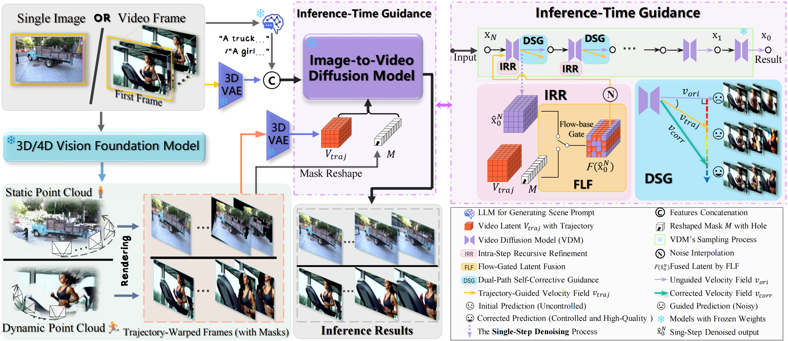

# WorldForge
<div align="center">

[](https://arxiv.org/abs/2509.15130)&nbsp;
[](https://worldforge-agi.github.io)&nbsp;
[](https://huggingface.co/papers/2509.15130)&nbsp;

</div>

**[WorldForge: Unlocking Emergent 3D/4D Generation in Video Diffusion via Training-Free Guidance](https://arxiv.org/abs/2509.15130)**

<div align="center">
  
</div>

[Chenxi Song](https://scholar.google.com/citations?hl=zh-CN&user=rytyb7QAAAAJ)<sup>1</sup>, [Yanming Yang](https://2hiTee.github.io)<sup>1</sup>, [Tong Zhao](https://tongzhao1030.github.io)<sup>1</sup>, [Ruibo Li](https://scholar.google.com/citations?hl=zh-CN&user=qtGY5T4AAAAJ&view_op=list_works&sortby=pubdate)<sup>2</sup>, [Chi Zhang](https://icoz69.github.io)<sup>1*</sup>

<sup>1</sup>AGI Lab, Westlake University  
<sup>2</sup>The College of Computing and Data Science, Nanyang Technological University  
<sup>*</sup>Corresponding Author

## TODO
- [x] Paper released on arXiv
- [x] Project page available
- [ ] Code and implementation details (**Coming very soon**)
- [ ] Inference pipeline and usage manual

## Update
- [2025.09] [arXiv](https://arxiv.org/abs/2509.15130) preprint is available.
- [2025.09] [Project page](https://worldforge-agi.github.io) is online.

## Introduction

Welcome to **WorldForge**! WorldForge is a training-free framework that unlocks the world-modeling potential of video diffusion models, delivering controllable 3D/4D generation with unprecedented realism. Our method leverages the rich latent world priors of large-scale video diffusion models to achieve precise trajectory control and photorealistic content generation without requiring additional training.

## Features

- **Training-Free Framework**: No additional training or fine-tuning required, preserving pretrained knowledge
- **Intra-Step Recursive Refinement (IRR)**: Recursive refinement mechanism during inference for precise trajectory injection
- **Flow-Gated Latent Fusion (FLF)**: Leverages optical flow similarity to decouple motion from appearance in latent space
- **Dual-Path Self-Corrective Guidance (DSG)**: Adaptively corrects trajectory drift through guided and unguided path comparison
- **3D Scene Generation**: Generate controllable 3D scenes from single view images
- **4D Video Re-cam**: Dynamic trajectory-controlled re-rendering of video content
- **Video Editing**: Support for object removal, addition, face swapping, and subject transformation

## Method Overview



WorldForge adopts a warping-and-repainting pipeline with three complementary mechanisms:

1. **IRR (Intra-Step Recursive Refinement)**: Enables precise trajectory injection through recursive optimization
2. **FLF (Flow-Gated Latent Fusion)**: Selectively injects trajectory guidance into motion-related channels
3. **DSG (Dual-Path Self-Corrective Guidance)**: Maintains trajectory consistency and visual fidelity

## Results

### 3D Scene Generation from Single View
<div align="center" style="display: flex; gap: 20px; justify-content: center; align-items: center;">
  
  
</div>
<div align="center" style="margin-top: 10px; font-size: 1.8em; font-weight: bold; color: #555;">
  ...
</div>

### 4D Video Re-cam
<div align="center" style="display: flex; gap: 20px; justify-content: center; align-items: center;">
  
  
</div>
<div align="center" style="margin-top: 10px; font-size: 1.8em; font-weight: bold; color: #555;">
  ...
</div>

### Video Editing Applications
<div align="center" style="display: flex; gap: 20px; justify-content: center; align-items: center;">
  
  
</div>
<div align="center" style="margin-top: 10px; font-size: 1.8em; font-weight: bold; color: #555;">
  ...
</div>

We showcase diverse capabilities including:
- **3D Scene Generation**: Voyager experiences in artworks, AIGC content, portrait photography, city walks
- **4D Video Re-cam**: Camera arc rotation, local close-ups, outpainting, viewpoint transferring, video stabilization  
- **Video Editing**: Object removal/addition, face swapping, subject transformation, try-on applications

## Evaluation Results
Complete results and comparisons with other baselines will be available at: [Results Link - To be added]
<!-- 请提供评估结果的存储位置，可以是Google Drive链接或其他存储服务 -->

## Installation and Usage

### Prerequisites
```bash
# Installation instructions will be provided upon code release
# Requirements: Python 3.8+, PyTorch, etc.
```

### Quick Start
```bash
# Code and detailed usage instructions coming soon
# Example usage will be provided here
```

### Inference
```bash
# Training scripts (if applicable) and inference pipeline
# Detailed documentation will be available upon release
```

## Comparisons

Our method demonstrates superior performance compared to existing SOTA methods:
- **3D Scene Generation**: More consistent scene content under novel viewpoints with improved detail and trajectory accuracy
- **4D Video Re-cam**: Realistic high-quality content re-rendering along target trajectories
- **Quantitative Metrics**: Superior results in realism, trajectory consistency, and visual fidelity

<div align="center">
  
</div>


## Citation

```bibtex
@misc{song2025worldforgeunlockingemergent3d4d,
  title={WorldForge: Unlocking Emergent 3D/4D Generation in Video Diffusion Model via Training-Free Guidance}, 
  author={Chenxi Song and Yanming Yang and Tong Zhao and Ruibo Li and Chi Zhang},
  year={2025},
  url={https://arxiv.org/abs/2509.15130}, 
}
```

## Acknowledgments

We thank the research community for their valuable contributions to video diffusion models and 3D/4D generation. Special thanks to the following open-source projects that inspired and supported our work:

- [**Wan-2.1**](https://github.com/Wan-Video/Wan2.1) - Large-scale video generation model
- [**SVD (Stable Video Diffusion)**](https://github.com/Stability-AI/generative-models) - Video diffusion model by Stability AI
- [**VGGT**](https://vgg-t.github.io/) - 3D generation and reconstruction toolkit
- [**ReCamMaster**](https://github.com/KwaiVGI/ReCamMaster) - Trajectory-controlled video generation
- [**TrajectoryCrafter**](https://trajectorycrafter.github.io/) - Trajectory-based video synthesis
- [**NVS-Solver**](https://github.com/ZHU-Zhiyu/NVS_Solver) - Novel view synthesis solution
- [**ViewExtrapolator**](https://kunhao-liu.github.io/ViewExtrapolator) - View extrapolation for 3D scenes
- [**DepthCrafter**](https://github.com/Tencent/DepthCrafter) - Depth-aware video generation
- [**Mega-SAM**](https://github.com/mega-sam/mega-sam) - Large-scale segmentation model

## Contact

For questions and discussions, please feel free to contact:
- Chenxi Song: songchenxi@westlake.edu.cn
- Chi Zhang: chizhang@westlake.edu.cn

---

<div align="center">
<strong>🌟 Star us on GitHub if you find WorldForge useful! 🌟</strong>
</div>
